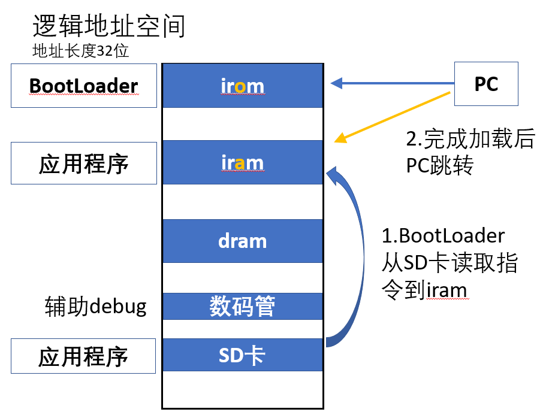

# BootLoader-of-C-and-Cross-Compiling
交叉编译程序为二进制指令存储于SD卡，C实现SD卡读取，将指令搬移到开发板并执行

## 项目开发环境
* Vivado 2019.1
* Modelsim SE-64 10.7
* Verilog

## 交叉编译环境
* 装有Ubuntu 18的WSL 1
* 其它编译链见[三级存储实验报告.pdf](三级存储实验报告.pdf) 交叉编译环境搭建 部分

## 其它材料
《自己动手写CPU》课后完整CPU代码

## C语言编写SD卡协议
我们知道，网上的SD卡协议的Verilog实现有很多，但是硬件编程确实相对软件编程要更令人恶心。

如果能仿照树莓派那种，把读写操作用C语言实现，那么开发效率会高很多。

### 总体思路四步走


更多详细信息见[三级存储实验报告.pdf](三级存储实验报告.pdf)

接口实现在[bootloader_cross_compile/course_design.srcs/sources_1/new/SD_soft.v](bootloader_cross_compile/course_design.srcs/sources_1/new/SD_soft.v)

SD卡读写协议实现在[makefile_cross_compile/BOOT.c](makefile_cross_compile/BOOT.c)

## makefile_cross_compile工程说明
交叉编译C语言程序为二进制指令，保存为.coe文件

交叉编译环境搭建方法具体见[三级存储实验报告.pdf](三级存储实验报告.pdf) 交叉编译环境搭建 部分

## bootloader_cross_compile工程说明
C实现SD卡读取，将指令搬移到开发板并执行

### 逻辑地址空间设计



### 整体模块图


## 结果说明展示


把结果输出到七段数码管的地址空间中，就可把读到的32位指令的十六进制编码显示：
```c
*((uint *)SEG_DA) = *p_text;
```

中间空循环以延迟时间，使得能看清七段数码管的结果：
```c
for(int k=0;k<1000000;k++);
```

上板后，七段数码管能看到指令，可以和coe文件进行比对，可以说明是正确的：


## 其它
SD卡型号不同可能导致结果失败，原因未明。

更多信息见[三级存储实验报告.pdf](三级存储实验报告.pdf)

尬吹可见[三级存储实验答辩ppt.pdf](三级存储实验答辩ppt.pdf)
